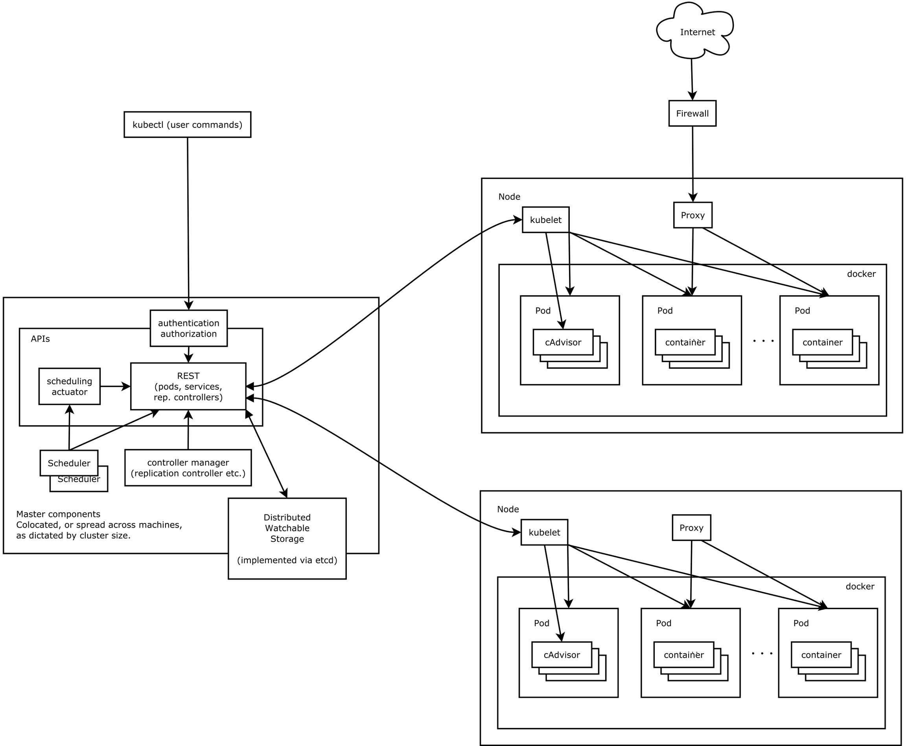
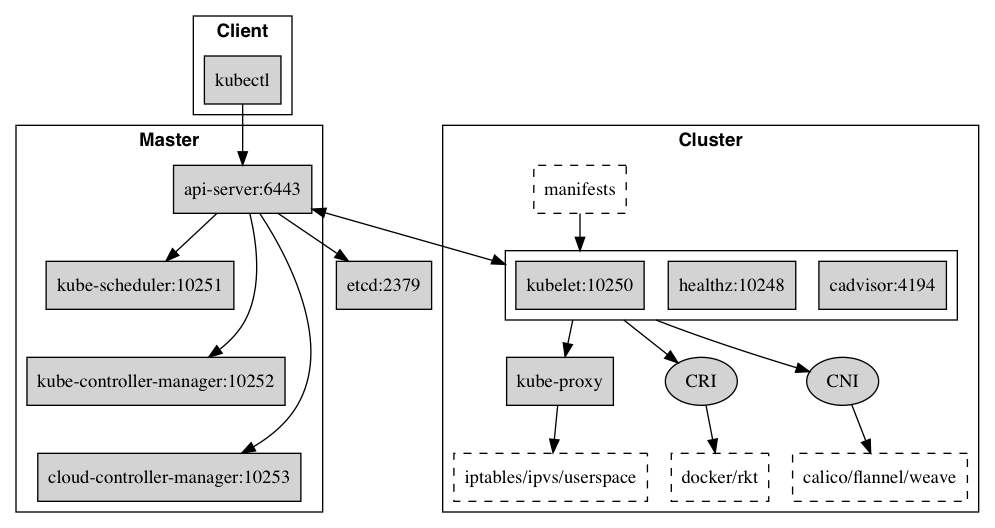
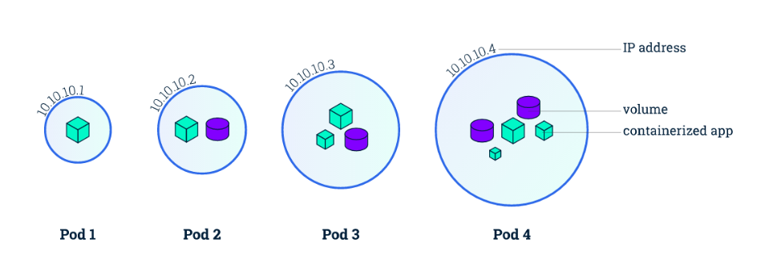
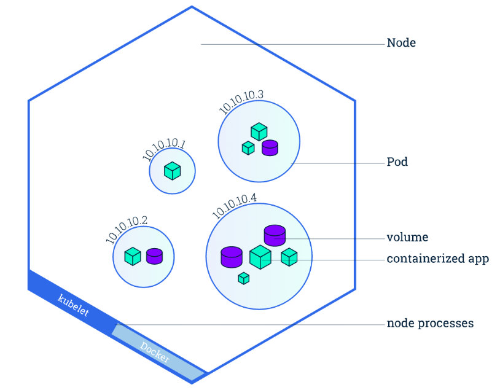
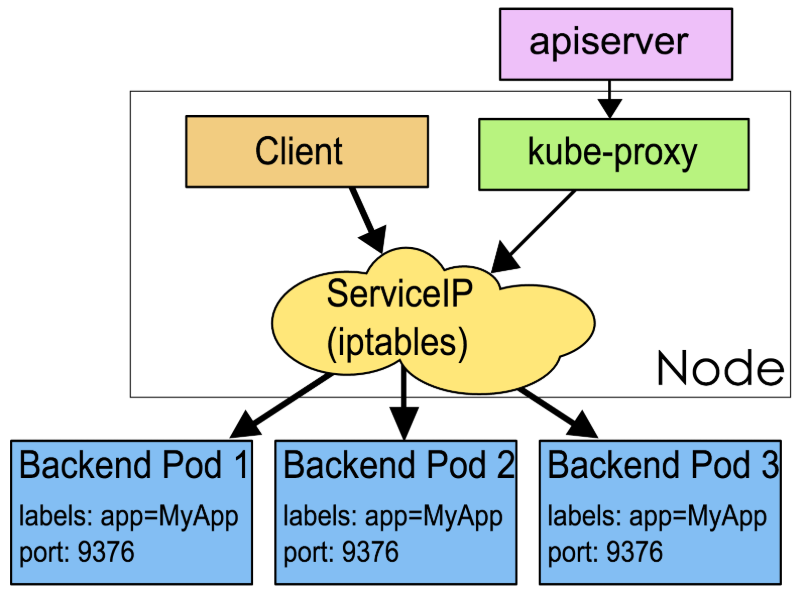

# 1. Cluster Architectuer



## 1.1 核心组件



### 1.1.1 Control Plane Components
1. kube-apiserver

   该组件负责公开了 Kubernetes API，负责处理接受请求的工作。 API server 是 Kubernetes 控制平面的前端。
   提供了资源操作的唯一入口，并提供认证、授权、访问控制、API 注册和发现等机制。

3. etcd

   etcd 保存了整个集群的状态。

5. kube-scheduler

   kube-scheduler 是控制平面的组件， 负责监视新创建的、未指定运行节点的 Pod，并选择节点来让 Pod 在上面运行。
   调度决策考虑的因素包括单个 Pod 及多个 Pod 集合的资源需求、 软硬件及策略约束、亲和性及反亲和性规范、数据位置、工作负载间的干扰及最后时限。

7. kube-controller-manager

   kube-controller-manager 负责维护集群的状态，比如故障检测、自动扩展、滚动更新等。
   控制器有许多不同类型。以下是一些例子：
   - Node 控制器：负责在节点出现故障时进行通知和响应
   - Job 控制器：监测代表一次性任务的 Job 对象，然后创建 Pod 来运行这些任务直至完成
   - EndpointSlice 控制器：填充 EndpointSlice 对象（以提供 Service 和 Pod 之间的链接）。
   - ServiceAccount 控制器：为新的命名空间创建默认的 ServiceAccount。

9. cloud-controller-manager

   一个 Kubernetes 控制平面组件， 嵌入了特定于云平台的控制逻辑。 云控制器管理器（Cloud Controller Manager）允许将你的集群连接到云提供商的 API 之上， 并将与该云平台交互的组件同与你的集群交互的组件分离开来。
   cloud-controller-manager 仅运行特定于云平台的控制器。 因此如果你在自己的环境中运行 Kubernetes，或者在本地计算机中运行学习环境， 所部署的集群不包含云控制器管理器。

### 1.1.2 Worker Plane Components
1. kubelet

   kubelet 会在集群中每个节点（node）上运行。 它保证容器（containers）都运行在 Pod 中， 负责维持容器的生命周期，同时也负责 Volume（CVI）和网络（CNI）的管理；
   kubelet 接收一组通过各类机制提供给它的 PodSpec，确保这些 PodSpec 中描述的容器处于运行状态且健康。 kubelet 不会管理不是由 Kubernetes 创建的容器。

3. kube-proxy

   kube-proxy 是集群中每个节点（node）上所运行的网络代理， 实现 Kubernetes 服务（Service） 概念的一部分, 负责为 Service 提供 cluster 内部的服务发现和负载均衡
   kube-proxy 维护节点上的一些网络规则， 这些网络规则会允许从集群内部或外部的网络会话与 Pod 进行网络通信。
   如果操作系统提供了可用的数据包过滤层，则 kube-proxy 会通过它来实现网络规则。 否则，kube-proxy 仅做流量转发。
   如果你使用网络插件为 Service 实现本身的数据包转发， 并提供与 kube-proxy 等效的行为，那么你不需要在集群中的节点上运行 kube-proxy。

5. 容器运行时

   这个基础组件使 Kubernetes 能够有效运行容器。 它负责管理 Kubernetes 环境中容器的执行和生命周期。
   Kubernetes 支持许多容器运行环境，例如 containerd、 CRI-O 以及 Kubernetes CRI (容器运行环境接口) 的其他任何实现。

### 1.1.3 Addons
插件使用 Kubernetes 资源（DaemonSet、 Deployment 等）实现集群功能。 因为这些插件提供集群级别的功能，插件中命名空间域的资源属于 kube-system 命名空间。
可用插件的完整列表， 请参见[插件（Addons）](https://kubernetes.io/zh-cn/docs/concepts/cluster-administration/addons/)。

---

# 2. 基本概念
## 2.1 Container

Container（容器）是一种便携式、轻量级的操作系统级虚拟化技术。它使用 namespace 隔离不同的软件运行环境，并通过镜像自包含软件的运行环境，从而使得容器可以很方便的在任何地方运行。

由于容器体积小且启动快，因此可以在每个容器镜像中打包一个应用程序。这种一对一的应用镜像关系拥有很多好处。使用容器，不需要与外部的基础架构环境绑定, 因为每一个应用程序都不需要外部依赖，更不需要与外部的基础架构环境依赖。完美解决了从开发到生产环境的一致性问题。

容器同样比虚拟机更加透明，这有助于监测和管理。尤其是容器进程的生命周期由基础设施管理，而不是被进程管理器隐藏在容器内部。最后，每个应用程序用容器封装，管理容器部署就等同于管理应用程序部署。

其他容器的优点还包括

* 敏捷的应用程序创建和部署: 与虚拟机镜像相比，容器镜像更易用、更高效。
* 持续开发、集成和部署: 提供可靠与频繁的容器镜像构建、部署和快速简便的回滚（镜像是不可变的）。
* 开发与运维的关注分离: 在构建/发布时即创建容器镜像，从而将应用与基础架构分离。
* 开发、测试与生产环境的一致性: 在笔记本电脑上运行和云中一样。
* 可观测：不仅显示操作系统的信息和度量，还显示应用自身的信息和度量。
* 云和操作系统的分发可移植性: 可运行在 Ubuntu, RHEL, CoreOS, 物理机, GKE 以及其他任何地方。
* 以应用为中心的管理: 从传统的硬件上部署操作系统提升到操作系统中部署应用程序。
* 松耦合、分布式、弹性伸缩、微服务: 应用程序被分成更小，更独立的模块，并可以动态管理和部署 - 而不是运行在专用设备上的大型单体程序。
* 资源隔离：可预测的应用程序性能。
* 资源利用：高效率和高密度。

## 2.2 Pod

Kubernetes 使用 Pod 来管理容器，每个 Pod 可以包含一个或多个紧密关联的容器。

Pod 是一组紧密关联的容器集合，它们共享 IPC 和 Network namespace，是 Kubernetes 调度的基本单位。Pod 内的多个容器共享网络和文件系统，可以通过进程间通信和文件共享这种简单高效的方式组合完成服务。



在 Kubernetes 中，所有对象都使用 manifest（yaml 或 json）来定义，比如一个简单的 nginx 服务可以定义为 nginx.yaml，它包含一个镜像为 nginx 的容器：

```yaml
apiVersion: v1
kind: Pod
metadata:
  name: nginx
  labels:
    app: nginx
spec:
  containers:
  - name: nginx
    image: nginx
    ports:
    - containerPort: 80
```

## 2.3 Node

Node 是 Pod 真正运行的主机，可以是物理机，也可以是虚拟机。为了管理 Pod，每个 Node 节点上至少要运行 container runtime（比如 docker 或者 rkt）、`kubelet` 和 `kube-proxy` 服务。



## 2.4 Namespace

Namespace 是对一组资源和对象的抽象集合，比如可以用来将系统内部的对象划分为不同的项目组或用户组。常见的 pods, services, replication controllers 和 deployments 等都是属于某一个 namespace 的（默认是 default），而 node, persistentVolumes 等则不属于任何 namespace。

## 2.5 Service

Service 是应用服务的抽象，通过 labels 为应用提供负载均衡和服务发现。匹配 labels 的 Pod IP 和端口列表组成 endpoints，由 kube-proxy 负责将服务 IP 负载均衡到这些 endpoints 上。

每个 Service 都会自动分配一个 cluster IP（仅在集群内部可访问的虚拟地址）和 DNS 名，其他容器可以通过该地址或 DNS 来访问服务，而不需要了解后端容器的运行。



```yaml
apiVersion: v1
kind: Service
metadata:
  name: nginx
spec:
  ports:
  - port: 8078 # the port that this service should serve on
    name: http
    # the container on each pod to connect to, can be a name
    # (e.g. 'www') or a number (e.g. 80)
    targetPort: 80
    protocol: TCP
  selector:
    app: nginx
```

## 2.6 Label

Label 是识别 Kubernetes 对象的标签，以 key/value 的方式附加到对象上（key 最长不能超过 63 字节，value 可以为空，也可以是不超过 253 字节的字符串）。

Label 不提供唯一性，并且实际上经常是很多对象（如 Pods）都使用相同的 label 来标志具体的应用。

Label 定义好后其他对象可以使用 Label Selector 来选择一组相同 label 的对象（比如 ReplicaSet 和 Service 用 label 来选择一组 Pod）。Label Selector 支持以下几种方式：

* 等式，如 `app=nginx` 和 `env!=production`
* 集合，如 `env in (production, qa)`
* 多个 label（它们之间是 AND 关系），如 `app=nginx,env=test`

## 2.7 Annotations

Annotations 是 key/value 形式附加于对象的注解。不同于 Labels 用于标志和选择对象，Annotations 则是用来记录一些附加信息，用来辅助应用部署、安全策略以及调度策略等。比如 deployment 使用 annotations 来记录 rolling update 的状态。
