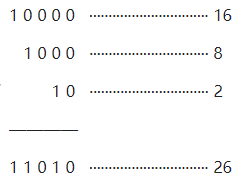
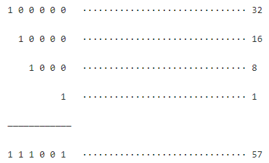
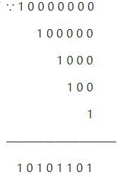
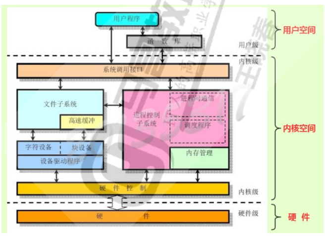
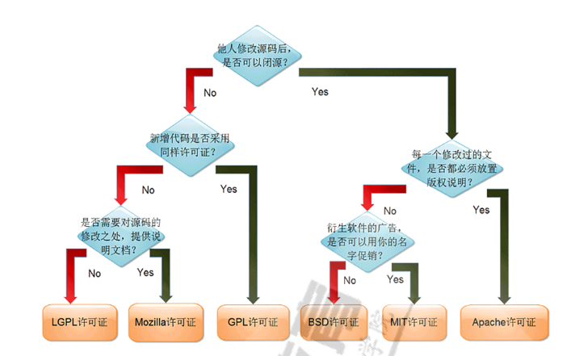

# 计算机基础和Linux安装

# 1.计算机系统

一个完整的计算机系统由硬件系统和软件系统两大部分组成。


## 1.1 冯·诺伊曼体系结构


8 个二进制位（bit，b）为 1 个字节（byte，B）。

00000000 ~ 11111111 （共有 2^8^ 种可能）


### 1.1.1 二进制

二进制，即逢 2 升位。

通过声卡、显卡等设备，将二进制数据转换成文字、图像、音视频等。

||二进制|十进制|
| -| ------------| ------|
||0|0|
|2^0|1|1|
|2^1|10|2|
||11|3|
|2^2|100|4|
||101|5|
||110|6|
||111|7|
|2^3|1000|8|
||…|…|
|2^4|10000|16|
||…|…|
|2^5|100000|32|
||…|…|
|2^6|1000000|64|
||…|…|
|2^7|10000000|128|
||...|...|
|2^8|100000000|256|
||..|...|
|2^9|1000000000|512|
||...|...|
|2^10|10000000000|1024|
||...|...|
|2^11|100000000000|2048|
||...|...|


#### 1.1.1.1 十进制转二进制

找最近的 2^n^ 的数字进行依次相减余数为 2^n^ 的时候，用二进制对位相加得出目标数字二进制数值。

**例1： 26**

∵ 26-16=10-8=2

∴ 26=16+8+2

∴ 26 的二进制表达为：




**例2： 57**

∵ 57-32=25-16=9-8=1

∴ 57=32+16+8+1

∴ 57 的二进制表达为：



‍

#### 1.1.1.2 二进制转十进制

将二进制的值拆分成 2^n^ 的值，将其数值相加即可。

**例1： 10101101**




∴ 10101101= 128+32+8+4+1=173


### 1.1.2 Linux 计算器—— `bc`

指令：`bc`

1. bc 计算器默认输入、输出都为 10 进制。

```powershell
[root@centos6 ~]# bc                                  #打开bc计算器
bc 1.06.95
Copyright 2006 Free Software Foundation, Inc.
This is free software with ABSOLUTELY NO WARRANTY.
For details type `warranty'. 
88*123                                                #计算 88*123
10824                                                 #计算器输出结果
#
#
123+65*2-100                                          #计算123+65*2-100
153                                                   #计算器输出结果
```

2. bc 计算器进制转换

> 先设置 `obase` 之后再设置 `ibase`，否则会输出异常。
>
> 且在计算过程中 ibase 与 obase 只能赋值一次。

```powershell
[root@centos6 ~]# bc
obase=16                                        #设置输出为16进制
ibase=2                                         #设置输入为2进制
1111111111111100011010                          #输入2进制数
3FFF1A                                          #转换为16进制
```

3. 通过管道运算与进制转换

这里使用的管道可以简单的理解为将 `echo"< content >"` 发送给 bc 计算器

```powershell
[root@centos6 ~]# echo "1+1" | bc               #将1+1发送给bc计算器
2
[root@centos6 ~]#
[root@centos6 ~]# echo "5*10-1" | bc            #将5*10-1发送给bc计算器
49
```

```powershell
#十进制转二进制：echo "obase=2;255" | bc
#八进制转十进制：echo "obase=10;ibase=8;377" | bc
#二进制转十进制：echo "obase=10;ibase=2;11111111" | bc
#二进制转16进制：echo "obase=16;ibase=2;11111111" | bc
[root@centos8 ~]#echo "obase=2;255" | bc
11111111
[root@centos8 ~]#echo "obase=10;ibase=8;377" | bc
255
[root@centos8 ~]#echo "obase=10;ibase=2;11111111" | bc
255
[root@centos8 ~]#echo "obase=16;ibase=2;11111111" | bc
FF
#注意前后顺序， ibase在前计算结果会有误。 如下：
[root@centos8 ~]#echo "ibase=2;obase=16;11111111" | bc
100110
```


## 1.2 操作系统相关概念

**接口：interface**

操作系统通过接口的方式，建立了用户与计算机硬件的沟通方式。用户通过调用操作系统的接口来使用计算机的各种计算服务。

为操作系统一般会提供两个重要的接口，来满足用户的一些一般性的使用需求：  

* 命令行：实际是一个叫shell的终端程序提供的功能，该程序底层的实质还是调用一些操作系统提供  
  的函数
* 窗口界面：通过图形窗口程序接收来自操作系统的消息，比如:鼠标、键盘动作，进而做出一些响应

**API：Application Programming Interface，应用程序编程接口**  
API定义了源代码和库之间的接口，因此同样的源代码可以在支持这个API的任何系统中编译。  

API 应用程序接口是一些预先定义的接口（如函数、HTTP接口），或指软件系统不同组成部分衔接的约定。用来提供应用程序与开发人员基于某软件或硬件得以访问的一组例程，而又无需访问源码，或理解内部工作机制的细节。

‍

**用户空间：User space**  
用户程序的运行空间。为了安全，它们是隔离的，即使用户的程序崩溃，内核也不受影响。

  
只能执行简单的运算，不能直接调用系统资源，必须通过系统接口（system call），才能向内核发出指令。

‍

**内核空间：Kernel space**  
Linux 内核的运行空间。  
可以执行任意命令，调用系统的一切资源

```powershell
str = "www.magedu.com"        // 用户空间
x = 100                       // 用户空间
x = x + 200                   // 用户空间
file.write(str)               // 切换到内核空间
y = x + 200                   // 切换回用户空间
```

说明：第一行和第二行都是简单的赋值运算，在 User space 执行。第三行需要写入文件，就要切换到Kernel space，因为用户不能直接写文件，必须通过内核安排。第四行又是赋值运算，就切换回 Userspace.

用户和内核空间：



‍**确定当前操作系统的位数**

```powershell
[root@centos8 ~]#getconf LONG_BIT
64

[root@rhel5 ~]# getconf LONG_BIT
32

root@ubuntu2004:~# arch
x86_64

[root@rhel5 ~]# arch
i686
```

32 位与 64 位操作系统的区别：CPU 一次能处理的最大位数。
* 32 位系统最多支持 2^32^=4GB 内存
* 64 位系统最多支持 2^64^B 内存

>i386 是 32 位系统镜像的常见标志。

## 1.3 GNU Project

**GNU： GNU is not Unix**

目标: 编写大量兼容于Unix系统的自由软件

‍

**GPL: GNU General Public License**

自由软件基金会：Free Software Foundation  

允许用户任意复制、传递、修改及再发布

基于自由软件修改再次发布的软件，仍需遵守GPL

‍

**LGPL：Lesser General Public License**

LGPL相对于GPL较为宽松，允许不公开全部源代码


## 1.4 各种开源协议




* GPLv2, GPLv3, LGPL(lesser) ：通用公共许可 copyleft
* Apache: apache
* BSD: bsd
* Mozilla
* MIT

查看软件的发行许可

```powershell
[root@host1 ~]# rpm -qi kernel
```
```powershell
Name        : kernel
Version     : 3.10.0
Release     : 1062.el7
Architecture: x86_64
Install Date: Wed 15 Apr 2020 07:50:52 PM EDT
Group       : System Environment/Kernel
Size        : 67060903
License     : GPLv2
Signature   : RSA/SHA256, Thu 22 Aug 2019 05:27:58 PM EDT, Key ID 24c6a8a7f4a80eb5
Source RPM  : kernel-3.10.0-1062.el7.src.rpm
Build Date  : Wed 07 Aug 2019 02:28:07 PM EDT
Build Host  : kbuilder.bsys.centos.org
Relocations : (not relocatable)
Packager    : CentOS BuildSystem <http://bugs.centos.org>
Vendor      : CentOS
URL         : http://www.kernel.org/
Summary     : The Linux kernel
Description :
The kernel package contains the Linux kernel (vmlinuz), the core of any
Linux operating system.  The kernel handles the basic functions
of the operating system: memory allocation, process allocation, device
input and output, etc.
Name        : kernel
Version     : 3.10.0
Release     : 1127.8.2.el7
Architecture: x86_64
Install Date: Mon 01 Jun 2020 12:51:16 AM EDT
Group       : System Environment/Kernel
Size        : 67357308
License     : GPLv2
Signature   : RSA/SHA256, Thu 14 May 2020 04:58:03 AM EDT, Key ID 24c6a8a7f4a80eb5
Source RPM  : kernel-3.10.0-1127.8.2.el7.src.rpm
Build Date  : Tue 12 May 2020 01:12:40 PM EDT
Build Host  : kbuilder.bsys.centos.org
Relocations : (not relocatable)
Packager    : CentOS BuildSystem <http://bugs.centos.org>
Vendor      : CentOS
URL         : http://www.kernel.org/
Summary     : The Linux kernel
Description :
The kernel package contains the Linux kernel (vmlinuz), the core of any
Linux operating system.  The kernel handles the basic functions
of the operating system: memory allocation, process allocation, device
input and output, etc.
```

```
[root@host1 ~]# rpm -qi openssh
```
```
Name        : openssh
Version     : 7.4p1
Release     : 21.el7
Architecture: x86_64
Install Date: Wed 15 Apr 2020 07:50:43 PM EDT
Group       : Applications/Internet
Size        : 1991172
License     : BSD
Signature   : RSA/SHA256, Thu 22 Aug 2019 05:37:23 PM EDT, Key ID 24c6a8a7f4a80eb5
Source RPM  : openssh-7.4p1-21.el7.src.rpm
Build Date  : Thu 08 Aug 2019 09:40:49 PM EDT
Build Host  : x86-01.bsys.centos.org
Relocations : (not relocatable)
Packager    : CentOS BuildSystem <http://bugs.centos.org>
Vendor      : CentOS
URL         : http://www.openssh.com/portable.html
Summary     : An open source implementation of SSH protocol versions 1 and 2
Description :
SSH (Secure SHell) is a program for logging into and executing
commands on a remote machine. SSH is intended to replace rlogin and
rsh, and to provide secure encrypted communications between two
untrusted hosts over an insecure network. X11 connections and
arbitrary TCP/IP ports can also be forwarded over the secure channel.

OpenSSH is OpenBSD's version of the last free version of SSH, bringing
it up to date in terms of security and features.

This package includes the core files necessary for both the OpenSSH
client and server. To make this package useful, you should also
install openssh-clients, openssh-server, or both.
```

‍

## 1.5 Unix/Linux 哲学思想

* 一切皆文件，包括硬件，如硬盘、网卡等
* 小型，单一用途的程序（指令）
* 链接程序，共同完成复杂的任务（将多个小程序组合起来完成复杂任务，即shell脚本）
* 避免令人困惑的用户界面
* 配置数据储存在文本中
‍
